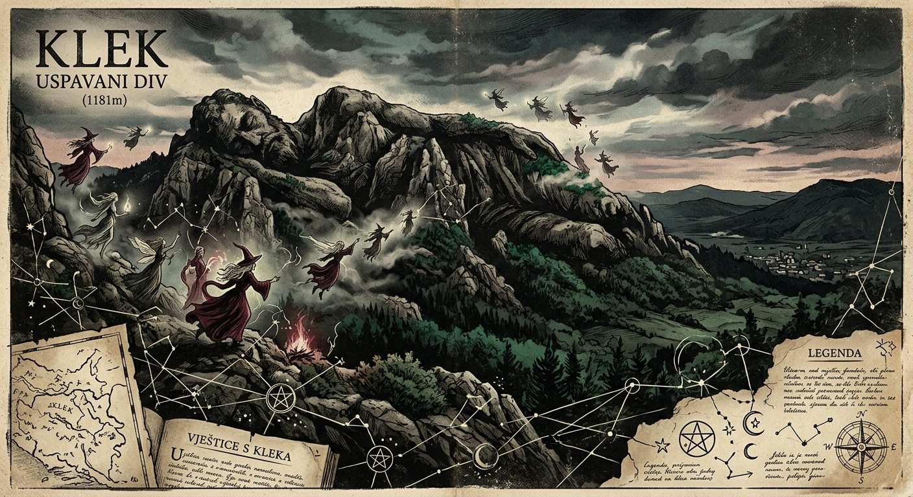

# Mreža Ogulinskih Autora: Arhiv Intelektualnog Identiteta

## Pregled Projekta
**Mreža Ogulinskih Autora** je interaktivna platforma za vizualizaciju i analizu intelektualnog naslijeđa grada Ogulina. Projekt istražuje duboke veze između autora, tematskih motiva i lokalnih legendi koje stoljećima oblikuju identitet ovog "Grada bajke".

Kroz naprednu mrežnu vizualizaciju (D3.js), korisnici mogu istražiti kako su se ideje, legende o Klečkim vješticama, Đulinom ponoru i Frankopanima ispreplitale u djelima pisaca poput Ivane Brlić-Mažuranić, povjesničara poput Emila Laszowskog i suvremenih čuvara baštine.

## Ključne Značajke
- **Interaktivni Graf Utjecaja**: Vizualni prikaz veza između autora, motiva i legendi.
- **Katalog Autora**: Detaljni dosjei s biografijama, bibliografijama i popisom ključnih motiva.
- **Mapiranje Legendi**: Poseban fokus na originalne legende (poput Uspavanog diva na Kleku) i njihov utjecaj na kulturni identitet.
- **AI Integracija**: Mogućnost dodavanja novih autora uz automatsko sugeriranje relacija putem Gemini AI-a.
- **Uređivački Dizajn**: Estetika nadahnuća starim arhivima i modernim grafičkim dizajnom (Editorial Design).

## Korištene Tehnologije
- **Frontend**: React 18, Vite, Tailwind CSS.
- **Vizualizacija**: D3.js za simulaciju sila i rendereiranje grafa.
- **Animacije**: Framer Motion za glatke prijelaze i interakcije.
- **AI**: Google Gemini API za inteligentno povezivanje podataka.
- **Tipografija**: Kombinacija klasičnih serifnih i modernih sans-serifnih fontova za arhivski feeling.

## Kako Koristiti
1. **Istražite Graf**: Kliknite na čvorove autora (crni krugovi) ili legendi (zeleni dijamanti) kako biste vidjeli detalje.
2. **Otkrijte Relacije**: Zadržite kursor iznad linija veze kako biste pročitali opis povijesnog ili tematskog utjecaja.
3. **Dodajte Istraživača**: Koristite tipku `+` u bočnoj traci kako biste dodali novog autora; AI će automatski analizirati motive i povezati ih s postojećom mrežom.

---
*Ovaj projekt služi kao digitalni spomenik intelektualnoj povijesti Ogulina.*
