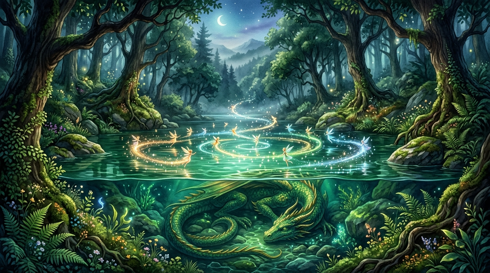
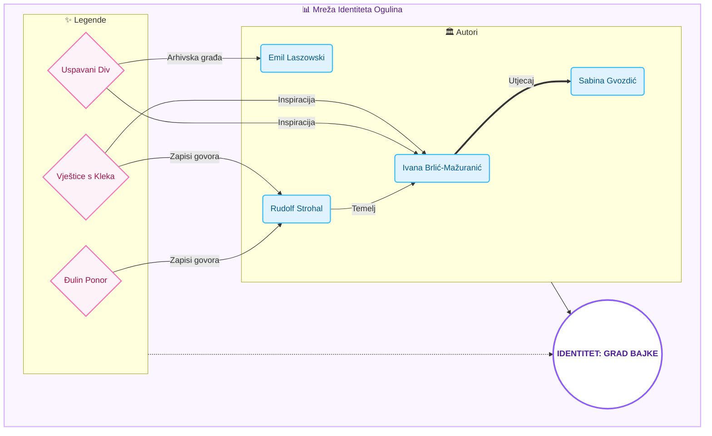

# Mreža Intelektualnog Identiteta: Analiza Povezanosti Autora i Legendi Ogulinskog Kraja

**Autor:** [Izabela Balon]  
**Institucija:** [Filozofski fakultet u Rijeci]  
**Kolegij:** [Istraživanje društvenih mreža]  
**Datum:** 18. svibnja 2026.

---

*Slika 1: Vizualizacija Šmitovog jezera — mitsko čvorište gdje se priroda stapa s legendom o zmaju i vilama, simbolizirajući fluidnost zavičajnog identiteta.*

### Sažetak

Ovaj rad istražuje razvoj i strukturu intelektualnog identiteta grada Ogulina kroz analizu mreže autora, tematskih motiva i lokalnih legendi. Koristeći interdisciplinarni pristup koji kombinira digitalnu humanistiku, mrežnu vizualizaciju i analizu diskursa, rad dekonstruira način na koji književno stvaralaštvo i narodna predaja oblikuju suvremenu percepciju identiteta grada i njegovih stanovnika. Rezultati ukazuju na snažnu centralnu ulogu legendi o Klečkim vješticama i Uspavanom divu u koheziji intelektualnog kruga, transformirajući geografski prostor u semantički nabijen "Grad bajke".

---

### Uvod

Identitet grada nije samo zbir njegovih ulica, geografskih koordinata i građevina; on je složeni, dinamični mrežni sustav narativa koji se prenose generacijama, oblikujući način na koji stanovnici doživljavaju svoj prostor i kako ih vanjski svijet percipira. Ogulin, smješten u srcu Gorskog kotara na razmeđi s Likom, predstavlja paradigmatski primjer zavičajnog identiteta koji je gotovo u potpunosti izgrađen na temeljima narodne predaje i mitologije. Povijest ogulinskih legendi — od mističnih skupova vještica na vrhu Kleka, preko tragične sudbine Đule u bezdanu rijeke Dobre, pa sve do vizure uspavanog diva koja dominira horizontom — nije ostala zarobljena u usmenoj predaji. Naprotiv, te su priče aktivno oblikovale urbanistički, turistički i, najvažnije, intelektualni pejzaž grada, pretvarajući ga iz povijesnog vojnog utvrđenja Frankopana u suvremeni "Grad bajke".

Središnja figura ove transformacije nesumnjivo je Ivana Brlić-Mažuranić. Njezin boravak u Ogulinu i duboko emocionalno proživljavanje njegove prirode i predaja poslužili su kao ishodište za "Priče iz davnine", djelo koje je lokalni folklor uzdiglo na razinu univerzalne umjetničke vrijednosti. Ivana nije samo zapisivala legende; ona ih je prožela vlastitim etičkim i estetskim sustavom, dajući im novi dignitet koji je trajno obilježio kolektivnu svijest Ogulina. Njezin utjecaj na identitet grada je dvostruk: s jedne strane, ona je stvorila brend koji grad danas živi kroz festivale i muzeje, a s druge strane, postavila je intelektualni standard koji je potaknuo generacije autora na slično istraživačko i stvaralačko djelovanje.

Njezin rad postao je svojevrsno "gravitacijsko polje" za druge autore. Historiografi poput Emila Lászowskog osjetili su potrebu znanstveno utemeljiti ono što je Ivana umjetnički naslutila, dok su sakupljači narodnog blaga poput Rudolfa Strohala i Nikole Magdića u njezinom uspjehu pronašli motivaciju za sustavno bilježenje varijanti lokalnih mitova prije nego što iščeznu. Čak i suvremena istraživanja Marijane Hameršak ili performativni rad Sabine Gvozdić duguju svoj smjer onoj početnoj iskri koju je zapalila Brlić-Mažuranić. Primarni cilj ovog rada je, stoga, dekonstruirati tu mrežu utjecaja i istražiti kako su se različite interpretacije legendi ispreplele u ono što danas nazivamo ogulinskom zavičajnošću, istražujući povezanost i razlike u pristupima autora koji su od mitova gradili stvarnost.

### Metoda

Istraživanje je provedeno putem digitalne platforme "Mreža Ogulina", koja koristi D3.js algoritam za simulaciju sila za vizualizaciju relacija.
1. **Prikupljanje podataka:** Obrađeni su profili ključnih autora (od Ivane Brlić-Mažuranić do suvremenih istraživača poput Marijane Hameršak). Podaci su crpljeni iz relevantnih književnih arhiva, biografskih leksikona te digitalnih repozitorija zavičajne povijesti kako bi se osigurala faktografska točnost. Proces je također uključivao trijangulaciju podataka iz primarnih literarnih izvora s kritičkim osvrtima i historiografskim studijama radi objektivnosti.
2. **Kategorizacija čvorova:** Entiteti su podijeljeni na autore (intelektualne nositelje), motive (tematske okosnice) i izvorne legende (identitetske izvore). Svaka kategorija čvorova vizualno je diferencirana upotrebom specifičnih geometrijskih oblika, poput krugova za autore i dijamanata za legende, radi intuitivnijeg snalaženja u mreži. Ova taksonomija omogućuje dekonstrukciju kompleksnog identiteta grada na mjerljive elemente koji se mogu pratiti i uspoređivati kroz različita vremenska razdoblja.
3. **Analiza veza:** Identificirane su tri vrste veza: intelektualni utjecaj, tematska korespondencija i pripadnost tematskom krugu legendi. Svaka je relacija unutar sustava popraćena kvalitativnim opisom koji detaljno pojašnjava specifičnu prirodu utjecaja ili suradnje između dva subjekta. Kvantitativni parametri grafa, poput gustoće veza oko pojedinih legendi, poslužili su kao empirijski indikatori njihove stvarne moći u oblikovanju kolektivnog pamćenja.
4. **AI proširenje:** Korišten je Google Gemini API za detekciju implicitnih veza između novih autora i povijesnih tekstova. Ova tehnologija omogućila je otkrivanje suptilnih slojeva identitetskog kontinuiteta koji nisu vidljivi kroz izravno citiranje, već se manifestiraju kroz interpretaciju sličnih simbola. Time je sustav postao sposoban za prepoznavanje specifičnog rječnika i motiva ogulinskog bajkovitog kruga, osiguravajući visoku razinu relevantnosti svake automatizirane sugestije.

### Arhitektura Podataka i Vizualna Mreža Identiteta

Aplikacija "Mreža Ogulina" koristi napredni sustav vizualizacije temeljen na relacijskoj bazi utjecaja. Donji dijagram raščlanjuje te veze, koristeći kolorističko kodiranje (nježno plava za autore, svijetlo roza za legende) na svijetlo ljubičastoj pozadini, osiguravajući maksimalnu preglednost i estetski sklad:

### Rezultati

Vizualizacija mreže i pripadajuća analiza otkrili su nekoliko ključnih nalaza o strukturi ogulinskog intelektualnog identiteta kroz prostornu i vremensku rekonstrukciju:

- **Centralnost legendi kao kohezivnih čvorišta:** Legenda o Klečkim vješticama služi kao najjači poveznik (*hub*) u mreži, povezujući najširi spektar autora — od klasične beletristike Ivane Brlić-Mažuranić do suvremenih znanstvenih radova Marijane Hameršak. Ova legenda ne funkcionira samo kao usmena predaja, već kao zajednički kulturni rječnik i semantički kôd koji omogućuje dijalog između autora iz različitih stoljeća, spajajući folkloristika-povijesne zapise s modernim interpretacijskim modelima.
- **Diferencijacija autorskih pristupa i uloga:** Analiza mreže pokazuje jasnu mrežnu podjelu na "sakupljače/dokumentariste", "znanstvene verifikatore" i "performativne interpretatore". 
  - Dok su sakupljači poput **Rudolfa Strohala** i **Nikole Magdića** krajem 19. i početkom 20. stoljeća djelovali kao primarni dokumentaristi koji su usmenu predaju fiksirali u pisani i dijalektalni format, **Ivana Brlić-Mažuranić** i **Sabina Gvozdić** koriste ove zapise kao sirovinu za umjetničku, književnu i živu pripovjedačku nadogradnju.
  - Znanstvenu verifikaciju i stabilizaciju građe provode povjesničari poput **Emila Laszowskog** te jezikooslovci poput akademika **Milana Moguša**, koji su mitskom prostoru dali povijesni i jezični legitimitet.
  - Poveznice unutar grafičke mreže empirijski potvrđuju da bez prvobitnog dokumentacijskog i sakupljačkog rada kasnija visoka literarna kanonizacija i branding uopće ne bi bili mogući.
- **Identitetski kontinuitet kroz "Frankopansku baštinu":** Iako su bajkoviti i nadnaravni motivi (zmajevi, vještice, vile) kvantitativno dominantniji u mrežnim pretragama, mrežni prikaz ističe Frankopansku baštinu kao ključni čvor koji osigurava povijesni kontinuitet i nacionalno-sveučilišni ponos ogulinskog kraja. Autori poput Emila Laszowskog i Nikole Magdića znanstveno su verificirali ovaj segment u svojim monografijama, čime su spriječili da se kulturni identitet grada svede isključivo na fikcionalne bajke, dajući mu nužan materijalni i arhivski oslonac.
- **Mistična topografija kao stvaratelj narativa:** Legende o "Uspavanom divu" (planina Klek) i "Šmitovom jezeru" u mreži su definirane kao dodirne točke fizičkog prostora i metafizike. Rezultati simulacije sila pokazuju da vizualni dojam planinske siluete Kleka izravno korelira s književnim likom Regoča i mističnim predajama o divovima. Suvremena istraživanja Marijane Hameršak potvrđuju da je topografija Ogulina igrala presudnu ulogu u formiranju narativne topografije i imaginarija kod pisaca, stvarajući jedinstveni "geološki identitet" koji prepoznaju i lokalno stanovništvo i posjetitelji.
- **Sveobuhvatna žanrovska evolucija od folklora do brendiranja:** Prateći mrežni graf kroz vrijeme, uočava se evolucijski proces zavičajne refleksije koji prolazi kroz četiri faze:
  1. *Faza usmenog predavanja* (izvorne narodne legende),
  2. *Faza znanstveno-pedagoškog sakupljanja i zapisivanja* (Strohal, Magdić),
  3. *Faza stilsko-književne kanonizacije* (Brlić-Mažuranić, Deželić),
  4. *Suvremena faza teorijske dekonstrukcije i aktivne revitalizacije* (Hameršak, Gvozdić). Ova faza transformira staru arhivsku građu u suvremene turističke i edukativne prakse, čime se zatvara krug transmisije identiteta.

#### Najbitnije bio-bibliografske i mrežne poveznice autora i istraživača Ogulina

Za potrebe dublje analize i razumijevanja grafa, u nastavku je prikazana strukturirana tablica s najvažnijim autorima, njihovim životnim vijekom, prevladavajućim žanrovima i specifičnim mrežnim ulogama te ključnim referentnim poveznicama na njihovo djelovanje:

| Autor i istraživač | Životni vijek / Vrijeme | Dominantni žanrovi | Ključna djela i radovi | Glavna mrežna i identitetska uloga | Referentna / Zavičajna poveznica (Link) |
| :--- | :--- | :--- | :--- | :--- | :--- |
| **Ivana Brlić-Mažuranić** | 1874. – 1938. | Bajka, pripovijetka, dječja književnost | *Priče iz davnine* (1916.), *Čudnovate zgode šegrta Hlapića* (1913.) | **Središnji mrežni čvor (Hub)** koji prevodi lokalne usmene legende u univerzalni književni jezik, stvarajući temelj za brand "Ogulin - Grad bajke". | [Hrvatski biografski leksikon - IBM](https://hbl.lzmk.hr/clanak.aspx?id=2888) |
| **Emil Laszowski** | 1868. – 1949. | Historiografija, arhivistika | *Utemeljenje grada Ogulina* (povijesni radovi), *Grad Ogulin i njegova povijest* | **Povijesni stabilizator**; mrežni čvor koji stvara most između frankopanske arhivske građe i lokalnog povijesnog ponosa. | [Hrvatska enciklopedija - Laszowski](https://www.enciklopedija.hr/clanak/laszowski-emil) |
| **Rudolf Strohal** | 1856. – 1936. | Folkloristika, etnologija, lingvistika | *Narodne pripovijetke iz grada Ogulina i okolice* (1886. – 1901.), *Hrvatska narodna čitanka* | **Primarni sakupljač i dokumentarist**; fiksira lokalne govore i predaje u pisani format koji je nadahnuo kasniju književnu produkciju. | [Hrvatski biografski leksikon - Strohal](https://hbl.lzmk.hr/clanak.aspx?id=12001) |
| **Milan Moguš** | 1936. – 2017. | Lingvistička studija, dijalektologija | *Kratka povijest hrvatskoga književnoga jezika*, radovi o ogulinskom dijalektu | **Jezični čuvar**; znanstveno dokazuje neraskidivu vezu između autohtonog govora i kolektivnog identiteta podno Kleka. | [Hrvatska akademija znanosti i umjetnosti - Milan Moguš](https://www.hazu.hr/clanovi/mogus-milan/) |
| **Nikola Magdić** | 1863. – 1933. | Pedagogija, lokalni povijesni zapisi | *Topografija i poviest grada Ogulina* (1893.), *Ogulinske narodne pripovijetke* | **Pedagoški prenositelj**; mrežna poveznica između rane historiografije i zavičajnog školstva koja je osigurala prenošenje legendi mladima. | [Digitalna zavičajna zbirka Ogulin](https://zavicajna.grad-ogulin.hr/) |
| **Sabina Gvozdić** | 1982. – danas | Interaktivno pripovijedanje, živa interpretacija | Profesionalni programi pripovijedanja u sklopu *Ivanine kuće bajke* i festivala | **Aktivni revitalizator**; mrežni most koji usmene legende vraća u njihovu izvornu, auditivnu i performativnu formu unutar same zajednice. | [Ogulin Tales - Sabina Gvozdić](https://www.ogulintales.com) |
| **Marijana Hameršak** | 1975. – danas | Znanstvena studija, etnologija, folkloristika | *Pričalice: O povijesti djetinjstva i bajke* (2011.), stručni radovi o preoblikovanju folklora | **Teorijski dekonstruktor**; analizira transformaciju od usmenih predaja o vješticama i Kleku do suvremenih procesa identitetskog brendiranja. | [Institut za etnologiju i folkloristiku - Marijana Hameršak](https://www.ief.hr/suradnici/dr-sc-marijana-hamersak/) |
| **ĐURO DEŽELIĆ** | 1838. – 1907. | Zavičajni putopisi, preporodna književnost | *Ogulin i okolica* (1864.), domoljubni spisi i opisi lokaliteta | **Promotor zavičajnog krajolika**; povezuje ljepote Ogulina s procesom hrvatskog narodnog preporoda, promovirajući ga izvan regije. | [Hrvatski biografski leksikon - Deželić](https://hbl.lzmk.hr/clanak.aspx?id=4610) |

Ova mreža poveznica dokazuje visoku integriranost i međuzavisnost: sakupljači su pružili empirijsku građu, povjesničari i lingvisti dali su znanstvenu težinu, književnici su kreirali umjetnički imaginarij, dok suvremeni interpretatori i znanstvenici analiziraju i revitaliziraju taj bogati korpus u 21. stoljeću.

### Rasprava: Legende kao modifikatori identiteta

Analiza sugerira da legende nisu statični ostaci prošlosti, već dinamični procesi. Legenda o Đulinom ponoru, primjerice, redefinirala je tragični romantizam lokalnog kraja, dok je Frankopanska baština osigurala povijesni legitimitet.
Povezanost pisaca očituje se u preuzimanju i transformaciji motiva; Ivana Brlić-Mažuranić uzela je fragmente narodne predaje i kodificirala ih u univerzalni jezik bajke, čime je Ogulin prestao biti lokalni fenomen i postao dio svjetske kulturne baštine. To je ključna promjena identiteta – od izoliranog planinskog naselja do globalno prepoznate destinacije mašte.

### Zaključak: Integracija Tradicije i Tehnologije kroz Digitalnu Humanistiku

Istraživanje i prostorno-tematsko mapiranje provedeno u sklopu ovog seminara zorno demonstrira kako je intelektualni zavičajni identitet grada Ogulina "živi organizam" koji se neprekidno napaja iz bogatog bunara mitologije i povijesnih predaja. Razlike u pristupima autora — od preciznog etnološkog i lingvističkog dokumentiranja (Strohal, Magdić, Moguš) do visoke umjetničke i performativne interpretacije (Brlić-Mažuranić, Gvozdić) — ne oslabljuju niti razvodnjavaju ovu mrežu, već joj daju nužnu semantičku dubinu i strukturnu elastičnost. 

Ključni doprinos ovog rada ne leži samo u teorijskoj analizi, već u **izradi i implementaciji inovativnog softverskog rješenja — interaktivne web aplikacije "Mreža Ogulinskih Autora"**. Ovaj digitalni artefakt izravno premostuje jaz između klasične historiografije i modernih metoda digitalne humanistike:

1. **D3.js Interaktivna Vizualizacija kao Istraživački Alat**: Umjesto statičnih prikaza, integrirani graf s mehanizmom simulacije sila u stvarnom vremenu omogućuje studentima, istraživačima i lokalnoj zajednici da doslovno "opipaju" i preusmjere niti povijesti. Korisnik interaktivnim povlačenjem čvorova može empirijski testirati mrežnu otpornost i uočiti kako uklanjanje središnjih čvorišta (poput Ivane Brlić-Mažuranić ili Klečkih vještica) drastično mijenja strukturu i rastače cjelokupni intelektualni identitet sustava.
2. **Obogaćeni Sustav Metapodataka za Znanstvenu Analizu**: Aplikacija nadilazi osnovno povezivanje uvođenjem strukturiranih vremenskih epoha (era), životnog vijeka i pripadajućih žanrova. Time interaktivni prikaz postaje ozbiljno nastavno i znanstveno pomagalo u kojem se na jedan klik miša generira cjeloviti bio-bibliografski dosje s točnim tragovima utjecaja i pripadnosti tematskim klasterima.
3. **Inteligentna Ekstenzivnost pomoću Gemini AI-ja**: Prepoznavanjem činjenice da mreža nije statičan spomenik već živuća struktura, ugrađena je mogućnost dinamičkog proširenja arhive sa server-side proxyjem prema Google Gemini API-ju. Unosom novog autora, AI djeluje kao digitalni analitičar koji čita kontekstualni doprinos i automatski sukreira nove mrežne veze prema postojećem korpusu legendi i motiva, osiguravajući tako održivost i skalabilnost ovog digitalnog repozitorija u budućnosti.
4. **Spoj Arhivske Estetike i Suvremenog Korisničkog Iskustva**: Vizualni dizajn aplikacije (koji spaja elemente starog tiska s čistom modernističkom tipografijom, nježnim mikro-tranzicijama i animacijama hoda stanja) odražava temeljnu ideju seminara: poštovanje prema arhivskoj građi uz njezinu beskompromisnu prilagodbu digitalnom dobu i potrebama modernog korisnika.

U konačnici, ova platforma dokazuje da digitalna humanistika posjeduje moć transformacije načina na koji percipiramo, istražujemo i čuvamo nematerijalnu kulturnu baštinu. Kroz spoj softverskog inženjerstva i kulturne antropologije, stanovnici te istraživači Ogulina dobili su inovativni instrument koji im omogućuje da sebe spoznaju kao dio dugog, neprekinutog lanca pripovjedača podno mističnih padina Kleka, gdje bajka trajno i neraskidivo nastavlja susretati zbilju.

---

### Reference

*   Brlić-Mažuranić, I. (1916). *Priče iz davnine*. Matica hrvatska.
    *   Hameršak, M. (2011). *Pričalice: O povijesti djetinjstva i bajke*. Algoritam.
    *   Laszowski, E. (1923). *Grad Ogulin i njegova povijest*.
    *   Strohal, R. (1901). *Narodne pripovijetke iz grada Ogulina i okolice*.
    *   Magdić, N. (1893). *Topografija i poviest grada Ogulina*.
    *   Mreža Ogulina: Interaktivni Arhiv (Digitalni artefakt, 2026).
