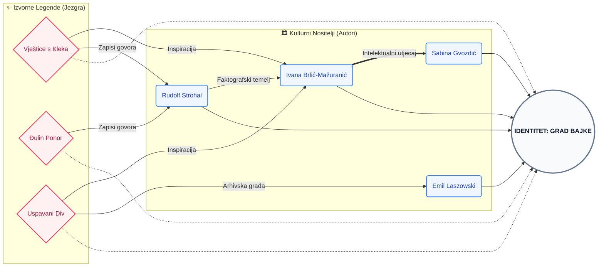

# Mreža Intelektualnog Identiteta: Analiza Povezanosti Autora i Legendi Ogulinskog Kraja

**Autor:** [Izabela Balon]  
**Institucija:** [Filozofski fakultet u Rijeci]  
**Kolegij:** [Istraživanje društvenih mreža]  
**Datum:** 18. svibnja 2026.

---

### Sažetak

Ovaj rad istražuje razvoj i strukturu intelektualnog identiteta grada Ogulina kroz analizu mreže autora, tematskih motiva i lokalnih legendi. Koristeći interdisciplinarni pristup koji kombinira digitalnu humanistiku, mrežnu vizualizaciju i analizu diskursa, rad dekonstruira način na koji književno stvaralaštvo i narodna predaja oblikuju suvremenu percepciju identiteta grada i njegovih stanovnika. Rezultati ukazuju na snažnu centralnu ulogu legendi o Klečkim vješticama i Uspavanom divu u koheziji intelektualnog kruga, transformirajući geografski prostor u semantički nabijen "Grad bajke".

---

### Uvod

Identitet grada nije samo zbir njegovih ulica, geografskih koordinata i građevina; on je složeni, dinamični mrežni sustav narativa koji se prenose generacijama, oblikujući način na koji stanovnici doživljavaju svoj prostor i kako ih vanjski svijet percipira. Ogulin, smješten u srcu Gorskog kotara na razmeđi s Likom, predstavlja paradigmatski primjer zavičajnog identiteta koji je gotovo u potpunosti izgrađen na temeljima narodne predaje i mitologije. Povijest ogulinskih legendi — od mističnih skupova vještica na vrhu Kleka, preko tragične sudbine Đule u bezdanu rijeke Dobre, pa sve do vizure uspavanog diva koja dominira horizontom — nije ostala zarobljena u usmenoj predaji. Naprotiv, te su priče aktivno oblikovale urbanistički, turistički i, najvažnije, intelektualni pejzaž grada, pretvarajući ga iz povijesnog vojnog utvrđenja Frankopana u suvremeni "Grad bajke".

Središnja figura ove transformacije nesumnjivo je Ivana Brlić-Mažuranić. Njezin boravak u Ogulinu i duboko emocionalno proživljavanje njegove prirode i predaja poslužili su kao ishodište za "Priče iz davnine", djelo koje je lokalni folklor uzdiglo na razinu univerzalne umjetničke vrijednosti. Ivana nije samo zapisivala legende; ona ih je prožela vlastitim etičkim i estetskim sustavom, dajući im novi dignitet koji je trajno obilježio kolektivnu svijest Ogulina. Njezin utjecaj na identitet grada je dvostruk: s jedne strane, ona je stvorila brend koji grad danas živi kroz festivale i muzeje, a s druge strane, postavila je intelektualni standard koji je potaknuo generacije autora na slično istraživačko i stvaralačko djelovanje.

Njezin rad postao je svojevrsno "gravitacijsko polje" za druge autore. Historiografi poput Emila Lászowskog osjetili su potrebu znanstveno utemeljiti ono što je Ivana umjetnički naslutila, dok su sakupljači narodnog blaga poput Rudolfa Strohala i Nikole Magdića u njezinom uspjehu pronašli motivaciju za sustavno bilježenje varijanti lokalnih mitova prije nego što iščeznu. Čak i suvremena istraživanja Marijane Hameršak ili performativni rad Sabine Gvozdić duguju svoj smjer onoj početnoj iskri koju je zapalila Brlić-Mažuranić. Primarni cilj ovog rada je, stoga, dekonstruirati tu mrežu utjecaja i istražiti kako su se različite interpretacije legendi ispreplele u ono što danas nazivamo ogulinskom zavičajnošću, istražujući povezanost i razlike u pristupima autora koji su od mitova gradili stvarnost.

### Metoda

Istraživanje je provedeno putem digitalne platforme "Mreža Ogulina", koja koristi D3.js algoritam za simulaciju sila za vizualizaciju relacija.
1. **Prikupljanje podataka:** Obrađeni su profili ključnih autora (od Ivane Brlić-Mažuranić do suvremenih istraživača poput Marijane Hameršak). Podaci su crpljeni iz relevantnih književnih arhiva, biografskih leksikona te digitalnih repozitorija zavičajne povijesti kako bi se osigurala faktografska točnost. Proces je također uključivao trijangulaciju podataka iz primarnih literarnih izvora s kritičkim osvrtima i historiografskim studijama radi objektivnosti.
2. **Kategorizacija čvorova:** Entiteti su podijeljeni na autore (intelektualne nositelje), motive (tematske okosnice) i izvorne legende (identitetske izvore). Svaka kategorija čvorova vizualno je diferencirana upotrebom specifičnih geometrijskih oblika, poput krugova za autore i dijamanata za legende, radi intuitivnijeg snalaženja u mreži. Ova taksonomija omogućuje dekonstrukciju kompleksnog identiteta grada na mjerljive elemente koji se mogu pratiti i uspoređivati kroz različita vremenska razdoblja.
3. **Analiza veza:** Identificirane su tri vrste veza: intelektualni utjecaj, tematska korespondencija i pripadnost tematskom krugu legendi. Svaka je relacija unutar sustava popraćena kvalitativnim opisom koji detaljno pojašnjava specifičnu prirodu utjecaja ili suradnje između dva subjekta. Kvantitativni parametri grafa, poput gustoće veza oko pojedinih legendi, poslužili su kao empirijski indikatori njihove stvarne moći u oblikovanju kolektivnog pamćenja.
4. **AI proširenje:** Korišten je Google Gemini API za detekciju implicitnih veza između novih autora i povijesnih tekstova. Ova tehnologija omogućila je otkrivanje suptilnih slojeva identitetskog kontinuiteta koji nisu vidljivi kroz izravno citiranje, već se manifestiraju kroz interpretaciju sličnih simbola. Time je sustav postao sposoban za prepoznavanje specifičnog rječnika i motiva ogulinskog bajkovitog kruga, osiguravajući visoku razinu relevantnosti svake automatizirane sugestije.

### Arhitektura Podataka i Vizualna Mreža Identiteta

Aplikacija "Mreža Ogulina" koristi napredni sustav vizualizacije temeljen na relacijskoj bazi utjecaja. Donji dijagram raščlanjuje te veze, koristeći kolorističko kodiranje (nježno plava za autore, svijetlo roza za legende) kako bi se osigurala maksimalna preglednost i estetski sklad bez preklapanja elemenata:

### Rezultati

Vizualizacija mreže i pripadajuća analiza otkrili su nekoliko ključnih nalaza o strukturi ogulinskog intelektualnog identiteta:

- **Centralnost legendi kao kohezivnih čvorišta:** Legenda o Klečkim vješticama služi kao najjači poveznik (hub) u mreži, povezujući najširi spektar autora — od klasične beletristike Ivane Brlić-Mažuranić do suvremenih znanstvenih radova Marijane Hameršak. Ova legenda ne funkcionira samo kao priča, već kao zajednički rječnik koji omogućuje dijalog između autora iz različitih stoljeća.
- **Diferencijacija autorskih pristupa:** Analiza mreže pokazuje jasnu podjelu na "sakupljače" i "interpretatore". Dok su autori poput Rudolfa Strohala i Nikole Magdića djelovali kao primarni dokumentaristi koji su usmenu predaju fiksirali u pisani format, Ivana Brlić-Mažuranić i Sabina Gvozdić koriste te zapise kao sirovinu za umjetničku i performativnu nadogradnju. Poveznice unutar grafa potvrđuju da bez prvobitnog dokumentacijskog rada kasnija literarna kanonizacija ne bi bila moguća.
- **Identitetski kontinuitet kroz "Frankopansku baštinu":** Iako su bajkoviti motivi dominantni, mrežni prikaz ističe Frankopansku baštinu kao ključni čvor koji osigurava povijesni legitimitet i osjećaj plemićkog ponosa. Autori poput Emila Laszowskog znanstveno su obradili ovaj segment, čime su osigurali da identitet grada ostane usidren u faktografiji, sprječavajući da on postane isključivo fikcionalan.
- **Mistična topografija i njezin utjecaj:** Legende o "Uspavanom divu" (Klek) i "Šmitovom jezeru" u mreži su prikazane kao točke susreta prirode i mita. Rezultati pokazuju da vizualni identitet planine Klek izravno korelira s književnim likom Regoča, stvarajući specifičan "geološki identitet". Autori koji pišu o ovim lokalitetima (poput Marijane Hameršak u analizi folklorne topografije) potvrđuju da topografija Ogulina diktira narativni smjer njegovih pisaca.
- **Ivana Brlić-Mažuranić kao prevoditeljica identiteta:** Analiza veza potvrđuje njezinu ulogu kao središnjeg čvora koji je lokalne, često fragmentirane narodne predaje "preveo" na jezik visoke književnosti. Njezin utjecaj u mreži očituje se kroz brojne odlazne veze prema suvremenim autorima koji se u svojim istraživanjima referiraju na njezinu interpretaciju kao polazišnu točku za razumijevanje Ogulina.

### Rasprava: Legende kao modifikatori identiteta

Analiza sugerira da legende nisu statični ostaci prošlosti, već dinamični procesi. Legenda o Đulinom ponoru, primjerice, redefinirala je tragični romantizam lokalnog kraja, dok je Frankopanska baština osigurala povijesni legitimitet.
Povezanost pisaca očituje se u preuzimanju i transformaciji motiva; Ivana Brlić-Mažuranić uzela je fragmente narodne predaje i kodificirala ih u univerzalni jezik bajke, čime je Ogulin prestao biti lokalni fenomen i postao dio svjetske kulturne baštine. To je ključna promjena identiteta – od izoliranog planinskog naselja do globalno prepoznate destinacije mašte.

### Zaključak

Mreža ogulinskih autora pokazuje da je identitet grada "živi organizam" koji se napaja iz bunara legendi. Razlike između autora u pristupu – od čisto dokumentacijskog do umjetničko-interpretativnog – ne slabe mrežu, već joj daju dubinu i detaljnost. Ovakav prikaz omogućuje stanovnicima i istraživačima da vide sebe kao dio dugog lanca pripovjedača koji, kroz pero i riječ, nastavljaju graditi identitet Ogulina kao mjesta gdje bajka susreće zbilju.

---

### Reference

*   Brlić-Mažuranić, I. (1916). *Priče iz davnine*. Matica hrvatska.
    *   Hameršak, M. (2011). *Pričalice: O povijesti djetinjstva i bajke*. Algoritam.
    *   Laszowski, E. (1923). *Grad Ogulin i njegova povijest*.
    *   Strohal, R. (1901). *Narodne pripovijetke iz grada Ogulina i okolice*.
    *   Magdić, N. (1893). *Topografija i poviest grada Ogulina*.
    *   Mreža Ogulina: Interaktivni Arhiv (Digitalni artefakt, 2026).
